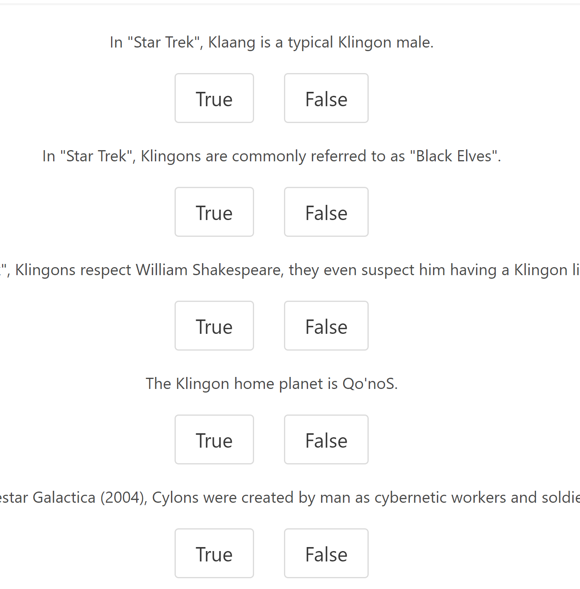

# TV Trivia

In this project our team developed an app that lets a user log in and get a score from answering 5 triva questions. 

Deployed app can be found here: https://project2kst.herokuapp.com/.

To begin, click the link above and click login, the website will tell you that you need to enter a email and password, this can be ignored as the requirement has been removed for demonstration purposes.

You will then be taken to an instruction page, read the instructions then click start

The application will then ask you to start the game, when you click start you will be faced with 5 questions about TV questions that are randomly pulled in from an API.

Once you click submit, your score will be shown at the top of the screen. From here you can play again.

## Technologies Used

- JavaScript

- Node.js

- Passport.js: Allows a user to create an account or login

- bcrypt was used to hash out the password when stored in the SQL Database

- Obtain the questions from a Trivia API

- Bulma was used for UI Design

# Contributors

- Trevor Burningham
- Kellie Hunsaker
- Stephen Green

## Future Improvements

Logout Feature
Leader Board
Live online play
